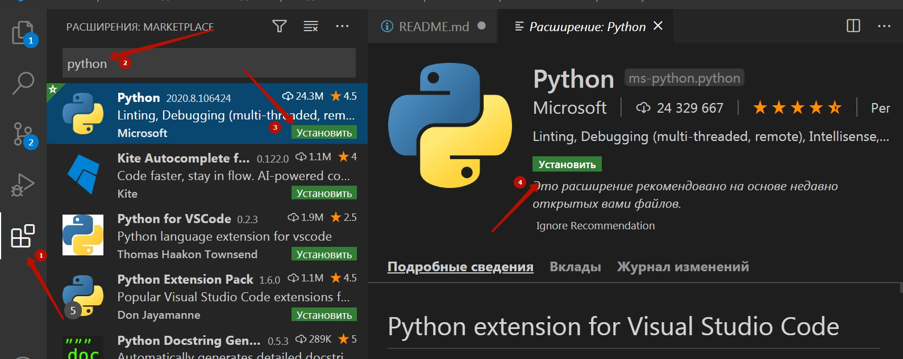
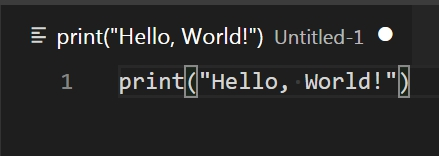
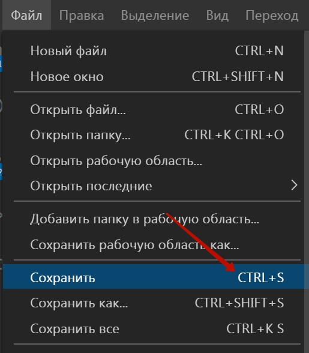
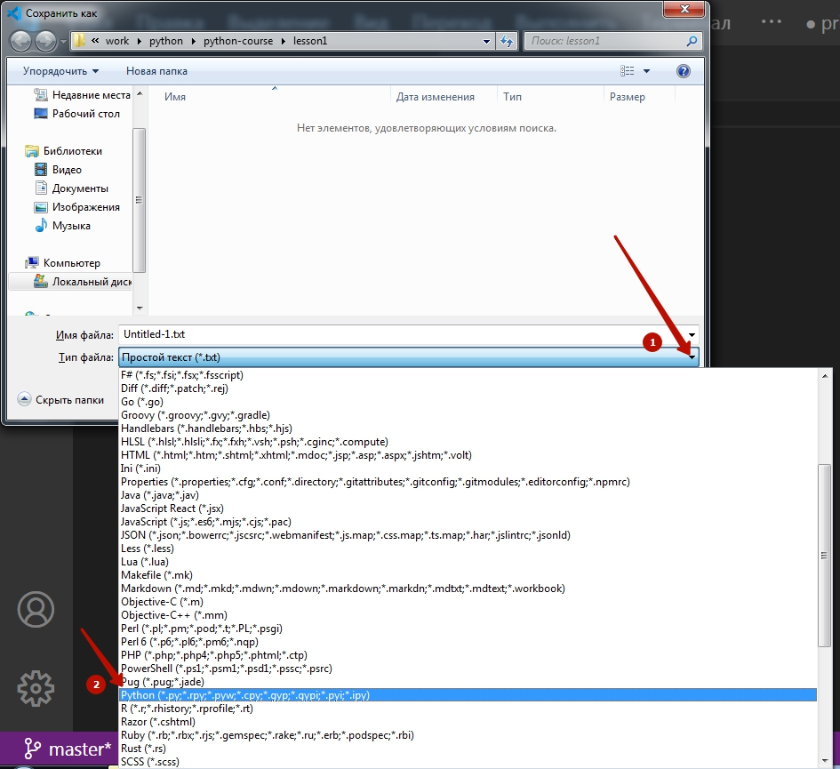
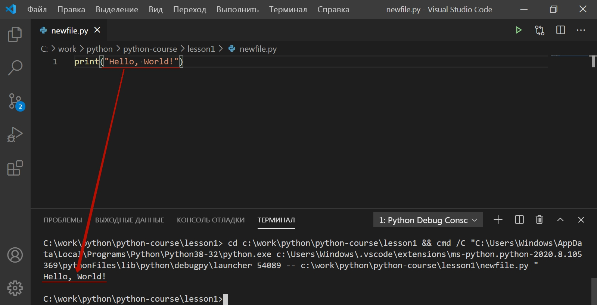

# Модуль 1. Старт
## Введение
Когда мы говорим о программировании, первое что приходит в голову это набор инструкций в файле — исходный код.  

**Исходный код (source code)** — набор фраз, слов, специальных символов и т. д., специфичных для языка программирования, описывающих набор инструкций для компьютера.  

Но символы, слова и фразы, которые составляют программу, на самом деле непонятны для машины. Есть шаг, выполняющийся после написания программы, который конвертирует исходный код в файле в набор инструкций понятных компьютеру. Этим занимается специальная программа: **компилятор** или **интерпретатор**.  

Отсюда можно сделать вывод - код пишется не для машины, а для разработчика. Исходный код должен не только верно решать задачу, но и иметь смысл, быть понятным и легко читаемым. Это одна из самых сложных задач для начинающих (и не только), на ее решение уйдет много времени и сил.  

## Логическое мышление
В мире существует много (сотни) языков программирования. На самом деле, они не такие сложные, как человеческие, потому что состоят из доволно маленького набора синтаксических конструкций, а их принцип работы и базовые концепции похожи между разными языками.

Опытные разработчики рассматривают проблемы с точки зрения алгоритмов — набора шагов, которые нужно выполнить для достижения определённой цели, даже если детали меняются.

Мы постоянно используем алгоритмы в повседневной жизни. Например процесс приготовления чая это набор необходимых шагов (алгоритм) для достижения результата. Когда вы привыкнете выстраивать решение задачи в виде алгоритма, язык программирования будет всего лишь инструментом.

## Системный подход в программировании
Упрощенно - у любой программы есть:
- Ввод (получение данных)
- Преобразование (вычисления, обработка данных)
- Вывод (вывод данных)

Такие элементы есть в любой программе:
- **Без вывода** программа не имеет смысла, потому что вы об этом не узнаете что она сделала.
- **Нет вычислений** - это не программа, а вычисляющее устройство (компьютер не нужен).
- **А если нет ввода** - программа не подключена к реальности.
Программы получают информацию от пользователей, других программ и могут считывать её из файлов на диске.

## Python
**Python** - высокоуровневый язык программирования общего назначения, ориентированный на повышение производительности разработчика и читаемости кода. Синтаксис ядра Python минималистичен. В то же время стандартная библиотека включает большой набор полезных функций.

Python, единственный из ТОП-5 языков программирования использует не Си-подобный синтаксис. Важной особенностью Python с точки зрения новичка является то, что количество пробелов в отступах имеет значения.

На сегодняшний день **Python** используют в таких сферах:
- Web-разработка
- Data Science
  - Data Minig (получение данных)
  - Machine Learinig (машинное обучение)
  - Deep Learning (глубинное обучение)

Так произошло не случайно:   
- в Web-разработке Python является всего лишь 2-м языком программирования (после PHP), 
    т.к. является скриптовым и может запускаться на сервере, увеличивает свою долю в основном за счет того, 
    что является более универсальным и удобным в разработке.
- В Data Science - является самым популярным языком из-за того, что он является простым в освоении 
    (динамический язык всегда проще статического), но и давно используется в научной сфере, а значит есть обширный
     набор библиотек, которые сейчас используются в сфере Data Science.

## Запуск программы
Для того, чтобы запустить программу на языке программирования Python на локальном компьютере необходимо:
- Скачать и установить интерпретатор Python https://www.python.org/downloads/
- Установить и настроить IDE
    - Скачать и установить программу <a href = 'https://code.visualstudio.com/'> Microsoft VS Code</a>
    - Установить расширение Python в Microsoft VS Code   
    - 

## Первая программа

```python
print("Hello, World!")
```

Для её запуска необходимо:<br>
<br>
<br>
<br>
<br>
<br>



Программа `print("Hello, World!")` выводит результат (текст `"Hello, World!"` к консоль)

Также вывод может осуществляться в файл на компьютере, в виде отправки запроса на сервер и т.п. 
С этими возможностями мы сможем ознакомиться на следующих занятиях.

## Выражения Python
Выражением называется совокупность переменных, операций, имен функций, скобок, которая может быть 
вычислена в соответствии с синтаксисом Python. 

Например, `2 + 3` -- это выражение. Выражения в Python отделяются друго от друга знаком переноса на новую строку.
Проще говоря, одна строка -- одно выражение. Выражения можно отделять друг от друга символом `;`, но такой 
синтаксис нежелателен, хотя и не вызывает ошибки.

Python выполняет выражения одно за другим по очереди сверху вниз и слева направо. 
Часто выражения называют командами, что не совсем правильно.

Выполнение одного выражения в интерпритируемом языке программирования -- это, по сути, выполнение очень простой 
программы которая делит память с другими подобными командами. 
Плюс такого подхода в гибкости написания программ и в том, что не надо компилировать всю программу при каждом изменении. 

Минус же в том, что если в коде есть ошибка, то вы не узнаете о её существовании пока программа не попытается выполнить 
команду с ошибкой и в более низкой скорости работы приложения.

## Переменные
Переменная -- это имя (псевдоним) для некотрой области памяти компъютера. Предполагается, что в этой памяти лежит
полезная для разрабочика информация к которой есть необходимость обращаться неоднократно.
Python, как и любой другой язык программирования работает с данными, которые размещаются в переменными.

**Переменная** - это ячейка памяти, у которой есть имя и в которой могут храниться данные.

Касательно именования переменных в Python есть три строгих правила:

* имя переменной в Python может состоять только из цифр, букв и знаков подчеркивания `_`; 
* имя переменной не может начинаться с цифры, но может со знака нижнего подчеркивания;
* использвование в качестве имени переменной зарезервированных слова будет приводить к ошибке.

Список зарезервированных слов:
`['False', 'None', 'True', 'and', 'as', 'assert', 'async', 'await', 'break', 'class', 'continue', 'def', 'del',
'elif', 'else', 'except', 'finally', 'for', 'from', 'global', 'if', 'import', 'in', 'is', 'lambda', 'nonlocal', 'not', 'or', 'pass', 'raise', 'return', 'try', 'while', 'with', 'yield']`

Получить список зарезервированных слов в Python можно, выполнив такую программу:
```python
import keyword
print (keyword.kwlist)
```

## Типы данных
Переменные могут быть различного типа (хранить информацию в различных форматах):

1. `None` -- пустое значение и "никакой" тип данных.

2. Числа (Numeric Type)
    - `int` – целое число
        - `bool` -- подтип `int`, который может принимать только два значения (`True` или `False`).
    - `float` – число с плавающей точкой
    - `complex` – комплексное число

3. Строки (Text Sequence Type)
    - `str` -- обычные строковые переменные в любой удобной кодировке (UTF-8 по умолчанию).
    - `bytes` -– байт-строки, строковые переменные где для хранения одного символа используется строго один байт (кодировка ASCII).
    - `bytearray` -- изменяемые байт-строки, дают возможность работать с такой строкой как со списком байтов.

4. Списки (Sequence Type)
    - `list` -– список, контейнер в котором упорядоченно хранятся любые данные.
    - `tuple` -– кортеж, тоже что и список, но неизменяемый.

7. Множества (Set Types)
    - `set` –- множество
    - `frozenset` –- неизменяемое множество

8. Словари (Mapping Types)
    - `dict` -– словарь

## Строки

Строковые переменные -- это упорядоченные неизменяемые наборы символов. "Упорядоченные" означает, что можно обращаться к символам
строк по индексу, копировать их, сравнивать, искать. "Неизменяемые" означает, что единожды создав строку нельзя изменить
её содержимое, можно только создать новую.

Для того, чтобы Python понял, что вы хотите создать строковую пременную необходимо заключить символы строки в кавычки.
Для этого подойдут как одинарные кавычки `'`, так и двойные `"`.

Например, создадим перменную `s` в которой хранится строка "Hello, World!": 
```python
s = "Hello, World!"
```

Для вывода строк можно использовать консоль, или командное окно. Чтобы вывести строку в консоль есть встроенная 
функция `print`. Эта функция принимает в качестве аргумента строку. Чтобы вызвать функцию Python достаточно
ввести имя этой функции в окне интерпритатора и аргументы в круглых скобках. Например, выведем строку "Hello, World!":
 
```python
s = "Hello, World!"
print(s)
```

### Операции над строками.

Основной операцией, которая реализована для строк это объединение строк (конкатенация)
```python
s1 = "Hello,"
s2 = " World!"
s = s1 + s2
print(s)
```
Операция конкатенации доступна как для переменных-строк, так и непосредственно строк, которые обернуты в кавычки.
```python
print("Hello," + " World!")
```
Для удобства вывода текста в Python применяют специальную конструкцию f-строки.
```python
name = "Oleg" 
print(f"Hello,{name}!") #Выведет Hello, Oleg!
```

#### Задания на строки
Работа со строкой и ф-строкой:
1. Сложите две строки так, чтобы в результате получилась строка “hello world!”. Не забудьте про пробел между словами.
s1 = ‘hello’
s2 = ‘world’
result = 
Правильный ответ: result = s1 + “ “ + s2
2. Ф-строки это такой синтаксис создания строковых переменных, когда внутри строки выполняется выражение Python. Напишите такую f-строку, которая выведет выражение 2 + 3 = 5 используя переменные x и y:
x = 2
y = 3
result = f”{x} + {y} = {x + y}}”
3. Функция user_name возвращает строку, которая формируется из переменных name и surname, которые передаются, как аргументы в эту функцию. 
Примеры правильной работы этой функции: если вызвать её как user_name(‘John’, ‘Dou’), то она вернет строку ‘John Dou’, если вызвать user_name(‘Іван’, ‘Цибуля’), то вернет строку `Іван Цибуля`.
Исправьте эту функцию, так чтобы она работала в соответствии с заданием
def user_name(name, surname):
result = f“”
	return result
Надо вставить result = f”{name} {surname}” или result = name + “ “ + surname

## Числа
> Зачем нужна математика?
> Это инструмент описания реального мира, построение его упрощенного описания, т.е. модели.
> 
> Представьте - продавец бы не знал математики. Он бы складывал монетки по весу! Когда сравняется - тогда можно продавать.
> В итоге сложных бы систем не существовало. Натуральное хозяйство, копья, мамонты…
> Плюс в том, что для программиста математики достаточно школьной.
> Минус - что для специалиста для анализа данных - нужна высшая математика: теория вероятностей, математическая статистика, математический анализ.


Первое для чего стали применять компьютеры - это математические расчеты. Во время второй мировой войны одна из первых ЭВМ Enigma (в Британии) занималась дешифровкой немецких шифрованных сообщений. 

Разберем создание программы уровня калькулятора:
```python
x = 2
y = 3
print(x + y) # вернёт 5
```

```python
x = 3
y = 2
print(x - y) # вернёт 1
```

```python
print(2 * 5) # выведет 10
```
```python
print(3 / 4) # выведет 0.75
```
Числовые типы данных в Python:
- int - целые числа 
- float - вещественные числа (числа с плавающей точкой)
- complex – комплексное число


Для целых чисел, кроме традиционных математических действий: +,-,*,/ определно также действие "остаток от деления" (%).
```python
print(5 % 2) # 1
print(4 % 2) # 0
print(3 % 2) # 1
print(2 % 2) # 0
print(1 % 2) # 1
```
> Обратите внимание, что остаток от деления на 2 равный нулю является признаком четности числа.

Также, из курса математики мы знаем о существовании функций.

>**Функция** (в математике) – это соответствие вида y = f(x) между переменными величинами, в силу которого каждому рассматриваемому значению некоторой переменной величины x (аргумента или независимой переменной) соответствует определенное значение другой переменной величины, y (зависимой переменной, иногда это значение просто называют значением функции).

В Python также реализованы различные математические функции:
```python
import math
print ()
print(math.sqrt(4)) #2.0
print(math.pow(5,2)) #25.0
```
Пример на встроенные математические функции
```python
from math import sin, cos, sqrt, pi
sin(pi/2) # 1
cos(pi) # -1
sqrt(16) # 4
```

## Логический тип
Логический тип (boolean) - это подтип `int`, целых чисел, который может принимать только 2 значения: 
True (истина) или False (ложь). 
Наиболее близкий пример из повседневной жизни -- это принятие решения да/нет (идти/не идти, 
подходит / не подходит, согласен / не согласен).

Результатом всех операци сравнения будет значение логического типа:
```python
print(3 < 4) #True
print(3 > 4) #False
print(3 == 3) #True
print(3 == 4) #False
```

## Тип None
В Python для обозначения пустого значения используется `None`
```python
a = None
```
`None` используется тогда, когда надо явно вернуть какое-то значение или создать его (зарезервировать имя для чего-то),
но по сути и смыслу никакой полезной инормации пока сохранить в этом значении нельзя, даже какого рода эта информация
(строка или число или что-то другое) пока не ясно. В таких случаях применяют `None`.

## Определение типов
**Python** - язык с динамической типизацией. Т.е. интерпретатор сам назначает тот тип, 
который на текущий момент соответствует значению переменной. 
Для того, чтобы узнать значение типа переменной используется встроенная функция `type()`, например:
```python
a = "qwe"
print(type(a)) #<class 'str'>
a = 4
print(type(a)) #<class 'int'>
a = 0.1
print(type(a)) #<class 'float'>
a = True
print(type(a)) #<class 'bool'>
a = None
print(type(a)) #<class 'NoneType'>
```
Динамческая типизация дает возможность писать код очень гибко и не думать о работе с памятью на элементарном уровне.
Но за эту гибкость приходится "платить" повышенной вероятностью допустить ошибку, когда вы получаете значение не того
типа, который ожидаете.

В примере выше ярко представлена суть "динамической" типизации, мы создаем перменную `a`, которая является строковой
перменной и содержит строку "qwe". Уже на третей строке кода `a` указывает на область памяти где хранится число 4.
При этом от разработчика не требуется определят тип `a`, отслеживать что мы записываем в `a` и не возникает ли конфликта.
Python делает эту рутинную работу за разработчика.

## Ввод данных:
Для ввода данных из консоли используется функция `input`. 
Значение аргумента функции (строка) будет выводиться в консоль, а далее -- будет активирован специальный курсор 
, который означает, что программа ждет ввода данных. 
Интерпритатор будет жлдать до тех пор, пока не встретит символ новой строки (Enter). 
После этого весь введенный с клавиатуры текст будет возвращен как результат работы функции `input`.
```python
a = input("Строка приглашение: ")
# На экране вы увидите: Строка приглашение: 
```
Переменная `a` получит то значение, которое ввел ползователь.

Важно помнить, что `input` возвращает строку и если вы хотите чтобы пользователь ввёл число, то надо будет потом 
сконвертировать строку в число.

## Комментарии.
Даже Вы в своём коде через месяц мало что вспомните. Поэтому очень важным инструментом являются комментарии.
Также комментарии используются в тех случаях, когда выполнять часть программы не нужно, но удалять эту часть пока рано.

Пример программы с комментариями.
```python
def magic(x, y):
    # Никто не знает что тут происходит, но работает правильно, НЕ ТРОГАТЬ!
    return map(lambda x, y: x ** (y-1)/2, filter(lambda x: bool(x // 7), [x * y for x, y in zip(x, y)]
```

## Операторы и операнды
Операнды и операторы - это части выражения. Операторы - определяют действие, операнды -- 
то с чем это действие будет произведено. В выражении `2 + 3` числа `3` и `2` будут операндами, а знак `+` - оператором.  

Для Python определены такие операторы:

### Арифметические операторы
|Оператор|Значение|Примеры|
|---|---|---|
|+|Сложение|3 + 3 дает результат 6 <br> 4 + 5 дает результат 9|
|-|Вычитание|3 - 2 дает результат 1 <br> 5 - 5 дает результат 0|
|*|Умножение|2 * 2 дает результат 4 <br> 6 * 3 дает результат 18|
|/|Деление| 2 / 2 дает результат 1 <br> 5 / 2 дает результат 2.5 <br> 6 / 3 дает результат 2|
|%|Остаток от деления|5 % 2 дает результат 1<br> 30 % 3 дает результат 0|
|//|Деление на цело| 5 // 2 дает результат 1<br> 26 // 8 дает результат 3|
|**|Возведение в степень| 2 ** 8 дает результат 32 <br> 5 ** 2 дает результат 25|  
Операндами для арифметических операторов являются числа.  

### Операторы сравнения
|Оператор|Значение|Примеры|
|---|---|---|
|==|равно|3 == 3 дает результат True<br> 4 == 5 дает результат False|
|!=|не равно|5 != 3 дает результат True<br> 4 != 4 дает результат False|
|<>|не равно (аналогично !=)|5 <> 3 дает результат True<br> 4 <> 4 дает результат False|
|>|больше|7 > 3 дает результат True <br> 2 > 2 дает результат False|
|>=|больше или равно|7 >= 3 дает результат True <br> 2 >= 2 дает результат True|
|<|меньше|8 < 4 дает результат False <br> 4 < 7 дает результат True|
|<=|меньше или равно|12 <= 34 дает результат True <br> 34 <= 34 дает результат True|

### Логические операторы
|Оператор|Значение|Примеры|
|---|---|---|
|and|Логическое "И"|True and True дает результат True <br>True and False дает результат False 
<br>False and True дает результат False <br>False and False дает результат False|
|or|Логическое "ИЛИ"|True or True дает результат True <br>True or False дает результат True 
<br> False or True дает результат True <br>False or False дает результат False|
|not|Логическое "НЕ"|not True дает результат False <br> not False дает результат True|

### Операторы присваивания
|Оператор|Значение|Примеры|
|---|---|---|
|=|Присвоить|a=2 <br> a имеет значение 2|
|+=|Сложить и присвоить|a=2 <br>a+=2 <br> a имеет значение 4|
|-=|Вычесть и присвоить|a=9<br>a-=3 <br> a имеет значение 6|
|*=|Умножить и присвоить|a=2<br>a*=3<br> a имеет значение 6|
|/=|Разделить и присвоить|a=18<br>a/=3<br> a имеет значение 6|
|%=|Взять остаток от деления и присвоить|a=15<br>a%=2<br> a имеет значение 2|
|**=|Возвести в степень и присвоить|a=2<br>a**=8<br> a имеет значение 32|
|//=|Разделить нацело и присвоить|a=7<br>a//=2<br> a имеет значение 3|

### Операторы членства
|Оператор|Значение|Примеры|
|---|---|---|
|in|Если элемент присутствует в последовательности - возвращает True<br>В противном случае -- 
возвращает False|1 in [2,5,1,7] вернет True<br>'IT' in 'GoIT' вернет True<br> 'age' in {'name':'Max','age':19} 
Вернет True <br>'Max' in {'name':'Max','age':19} вернет False |
|not in|Если элемент присутствует в последовательности - возвращает False<br>В противном случае --
возвращает True|1 in [2,5,1,7] вернет False<br>'IT' in 'GoIT' вернет False<br> 'age' in {'name':'Max','age':19} 
Вернет False <br>'Max' in {'name':'Max','age':19} вернет True |

### Операторы тождественности
|Оператор|Значение|Примеры|
|---|---|---|
|is|Если два операнда указывают на один и тот же объект -- вернет True|x is y вернет True, если id(x) равно id(y)|
|not is|сли два не операнда указывают на разные объекты -- вернет False|x is not y вернет True, если id(x) не равно id(y)|

*id() - функция, которая возвращает уникальный идентификатор объекта*

## Порядок выполнения операций в выражении

Python выполняет операции в выражении в том же порядке, в котором выполняются математические опреации. 
Сначала выполняется выражение в скобках, потом возведенние в степень, потом умножение, потом сложение и вычитание.

После математических операции выполняются битовые операторы булевой (логической) алгебры 
(битовые сдвиги, битовые логические операции). 

Далее на очереди будут операторы сравнения и логические операторы.

При этом любой опранд, который является выражением Python, будет выполнен, когда возникнет необходимость узнать его 
значение.
