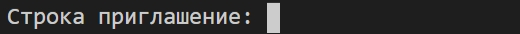

# Модуль 1. Старт

## Введение

Когда мы говорим о программировании, первое что приходит в голову это набор инструкций в файле &mdash; исходный код.

```python
print("Hello World!")
```

Выше представлен пример исходного кода скрипта, который при запуске выводит в консоль текст `"Hello World!"`.

**Исходный код (source code)** &mdash; набор фраз, слов, специальных символов и т. д., специфичных для языка
программирования, описывающих набор инструкций для компьютера.  

Но символы, слова и фразы, которые составляют программу, на самом деле непонятны для машины.
Есть шаг, выполняющийся после написания программы, который конвертирует исходный код в файле в набор инструкций понятных
компьютеру. Этим занимается специальная программа: **компилятор** или **интерпретатор**.  

Отсюда можно сделать вывод &mdash; код пишется не для машины, а для разработчика.
Исходный код должен не только верно решать задачу, но и иметь смысл, быть понятным и легко читаемым.
Это одна из самых сложных задач для начинающих (и не только), на ее решение уйдет много времени и сил.  

## Логическое мышление

В мире существует много (сотни) языков программирования. На самом деле, они не такие сложные, как человеческие,
потому что состоят из довольно маленького набора синтаксических конструкций, а их принцип работы и базовые концепции
похожи между разными языками.

Опытные разработчики рассматривают проблемы с точки зрения алгоритмов &mdash; набора шагов, которые нужно выполнить для
достижения определённой цели, даже если детали меняются.

Мы постоянно используем алгоритмы в повседневной жизни. Например процесс приготовления чая это набор необходимых шагов
(алгоритм) для достижения результата. Когда вы привыкнете выстраивать решение задачи в виде алгоритма, язык
программирования будет всего лишь инструментом.

## Системный подход в программировании

Упрощенно - у любой программы есть:

- Ввод (получение данных)
- Преобразование (вычисления, обработка данных)
- Вывод (вывод данных)

Такие элементы есть в любой программе:

- **Без вывода** программа не имеет смысла, потому что вы об этом не узнаете что она сделала.
- **Нет вычислений** &mdash; это не программа, а вычисляющее устройство (компьютер не нужен).
- **А если нет ввода** &mdash; программа не подключена к реальности.
Программы получают информацию от пользователей, других программ и могут считывать её из файлов на диске.

## Python

**Python** &mdash; высокоуровневый язык программирования общего назначения стандартная библиотека которого включает
большой набор полезных функций.

На сегодняшний день **Python** используют в таких сферах:

- Web-разработка
- Data Science
  - Data Minig (получение данных)
  - Machine Learinig (машинное обучение)
  - Deep Learning (глубинное обучение)

Так произошло не случайно:

- в Web-разработке Python является всего лишь 2-м языком программирования (после PHP),
    т.к. является скриптовым и может запускаться на сервере, увеличивает свою долю в основном за счет того,
    что является более универсальным и удобным в разработке.
- В Data Science &mdash; является самым популярным языком из-за того, что он является простым в освоении
    (динамический язык всегда проще статического), но и давно используется в научной сфере, а значит есть обширный
     набор библиотек, которые сейчас используются в сфере Data Science.

## Переменные

Переменная &mdash; это имя (псевдоним) для некоторой области памяти компьютера. Предполагается, что в этой памяти лежит
полезная для разработчика информация к которой есть необходимость обращаться неоднократно.
Python, как и любой другой язык программирования, работает с данными в памяти к которым обращаются посредством имен
(переменных).

**Переменная** - это ячейка памяти, у которой есть имя и в которой могут храниться данные.

```python
age = 20
user1_age = 30
user2_age = 30
ADULT_THR = 18

_do_not_use_this = 0
```

Касательно именования переменных в Python есть три строгих правила:

- имя переменной в Python может состоять только из цифр, букв и знаков подчеркивания `_`;
- имя переменной не может начинаться с цифры, но может со знака нижнего подчеркивания;
- использование в качестве имени переменной зарезервированных слова будет приводить к ошибке.

Список зарезервированных слов:
`False, None, True, and, as, assert, async, await, break, class, continue, def, del,
elif, else, except, finally, for, from, global, if, import, in, is, lambda, nonlocal, not,
or, pass, raise, return, try, while, with, yield`

## Инструкция

**Инструкция (statement)** — это связанный набор слов и символов из синтаксиса языка, которые объединяются,
чтобы выразить одну идею, одну инструкцию для машины.

```python
x = 2
y = x + 10
```

Это пример инструкции. В Python инструкци разделяются символом новой строки (начинаются с новой строки).
В примере выше две инструкции: `x = 2` и `y = x + 10`.

Обычно, одна строка &mdash; одна инструкция.
Инструкции можно отделять друг от друга символом `;`, но такой синтаксис нежелателен, хотя и не вызывает ошибки.

Python выполняет инструкции одну за одной по очереди слева направо и сверху вниз.
В нашем примере сначала выполнится `x = 2`, потом `y = x + 10`.

## Выражения Python

```python
a = 1
b = 2
c = a + b + 10
```

Выражением называется совокупность переменных, операций, имен функций, скобок, которая может быть
вычислена в соответствии с синтаксисом Python.

Например, `a + b + 10` &mdash; это выражение, `a` &mdash; выражение, `b` &mdash; выражение.

Выполнение одного выражения в интерпретируемом языке программирования &mdash; это, по сути, выполнение очень простой
программы которая делит память с другими подобными командами.
Плюс такого подхода в гибкости написания программ и в том, что не надо компилировать всю программу при каждом изменении.

Минус же в том, что если в коде есть ошибка, то вы не узнаете о её существовании пока программа не попытается выполнить
выражение с ошибкой и в более низкой скорости работы приложения.

## Операторы и операнды

Операнды и операторы &mdash; это части выражения. Операторы - определяют действие, операнды &mdash;
то с чем это действие будет произведено. В выражении `2 + 3` числа `3` и `2` будут операндами, а знак `+` - оператором.  

Для Python определены такие арифметические операторы:
| Оператор | Значение             | Примеры                                                                          |
| -------- | -------------------- | -------------------------------------------------------------------------------- |
| +        | Сложение             | 3 + 3 дает результат 6 <br> 4 + 5 дает результат 9                               |
| -        | Вычитание            | 3 - 2 дает результат 1 <br> 5 - 5 дает результат 0                               |
| *        | Умножение            | 2* 2 дает результат 4 <br> 6 * 3 дает результат 18                               |
| /        | Деление              | 2 / 2 дает результат 1 <br> 5 / 2 дает результат 2.5 <br> 6 / 3 дает результат 2 |
| %        | Остаток от деления   | 5 % 2 дает результат 1<br> 30 % 3 дает результат 0                               |
| //       | Деление на цело      | 5 // 2 дает результат 1<br> 26 // 8 дает результат 3                             |
| **       | Возведение в степень | 2** 8 дает результат 32 <br> 5 ** 2 дает результат 25                            |
Операндами для арифметических операторов являются числа.  

### Порядок выполнения операций в выражении

Python выполняет операции в выражении в том же порядке, в котором выполняются математические операции.
Сначала выполняется выражение в скобках, потом возведение в степень, потом умножение, потом сложение и вычитание.

При этом любой операнд, который является выражением Python, будет выполнен, когда возникнет необходимость узнать его
значение.

```python
x = 8**3 + 4*(2 + 2)
```

В результате выполнения этой инструкции в `x` будет записан означение 528. Сначала Python вычислит `8**3`, потом
`(2 + 2)`, далее результат `(2 + 2)` умножит на `4` и сложит результат с результатом `8**3`.

## Комментарии

Даже вы в своём коде через месяц мало что вспомните. Поэтому, очень важным инструментом разработчика являются комментарии.
Также комментарии используются в тех случаях, когда выполнять часть программы не нужно, но удалять эту часть пока рано.

Комментарии в Python обозначаются символом `#`, всё что после этого символа и до начала новой строки интерпретатор
просто проигнорирует.

```python
# user_age = 7
user_age = 18
user_status = "adult"   # 'adult' for users older 18 and 'child' for younger
```

## Типы данных

Переменные могут быть различного типа (хранить информацию в различных форматах):

1. `None` &mdash; пустое значение и "никакой" тип данных.
2. Числа (Numeric Type)
3. Boolean тип данных &mdash; подтип целых чисел.
4. Строки (Text Sequence Type)

## Тип None

В Python для обозначения пустого значения используется `None`

```python
a = None
```

`None` используется тогда, когда надо явно вернуть какое-то значение или создать его (зарезервировать имя для чего-то),
но по сути и смыслу никакой полезной информации пока сохранить в этом значении нельзя, даже какого рода эта информация
(строка или число или что-то другое) пока не ясно. В таких случаях применяют `None`.

## Числа

```python
int_number = 3
float_number = 3.3
complex_number = 3.3 + 2j
```

Числа в Python представлены целыми, дробными и комплексными числами. Python динамический язык, а значит
при создании переменной не нужно определять её тип. Интерпретатор сам определит к какому типу она относится исходя из
её значения и определит сколько памяти для неё выделить.

В примере выше инструкция `int_number = 3` создаст переменную **int_number** со значением **3** и **int_number** будет
типа `int`.

Инструкция `float_number = 3.3` создаст переменную **float_number** со значением **3.3**, **float_number** буде типа
`float`.

А инструкция `complex_number = 3.3 + 2j` создаст переменную **complex_number** со значением **3.3 + 2j** &mdash;
комплексное число.

## Строки

```python
hello_string = "Hello"
world_string = 'World!'
```

Строковые переменные &mdash; это упорядоченные неизменяемые наборы символов. "Упорядоченные" означает,
что можно обращаться к символам строк по индексу, копировать их, сравнивать, искать.
"Неизменяемые" означает, что единожды создав строку нельзя изменить её содержимое, можно только создать новую.

Для того, чтобы Python понял, что вы хотите создать строковую переменную необходимо заключить символы строки в кавычки.
Для этого подойдут как одинарные кавычки `'`, так и двойные `"`.

Например, создадим переменную `s` в которой хранится строка "Hello, World!":

```python
s = "Hello, World!"
```

### Операции над строками

```python
s1 = "Hello,"
s2 = " World!"
joined_string = s1 + s2
```

Основной операцией, которая реализована для строк это объединение строк (конкатенация). Конкатенация строк реализована
с использованием оператора сложения `+`. Если "сложить" две или более строк, то в результате получим объединенную
строку. В примере выше `joined_string` будет равным `"Hello, World!"`.

Для удобства вывода текста в Python применяют специальную конструкцию f-строки.

```python
name = "Oleg" 
hello_string = f"Hello, {name}!"
```

f-строка &mdash; это такой шаблон, который позволяет удобным образом генерировать строку подставляя результат
выполнения выражений в нужное место в шаблоне.

Синтаксически f-строка отличается от обычной тем, что в начале строки стоит символ `f`. Интерпретатор поймет, что если в
такой строке он встретит символы фигурных скобок `{}`, то внутри них содержится выражение, которое надо выполнить и
результат подставить в строку.

В примере `hello_string` будет равна `"Hello, Oleg!"`.

## Boolean

Boolean тип данных &mdash; подтип целых чисел, который может принимать только два значения, `True` или `False`.

### Создание переменных типа `bool`

Есть 2 простых способа создать переменную с типом `bool`:

- Присвоить переменной значение `True` или `False`

    ```python
    a = True
    b = False
    ```

- Присвоить переменной результат выполнения логического выражения, например сравнения:

  ```python
  age = 18
  adult1 = age >= 18    # True

  age = 15
  adult2 = age >= 18    # False
  ```

### Выражения сравнения

Для сравнения в Python есть операторы `<` (меньше), `<=` (меньше или равно), `>` (Больше), `>=` (больше или равно), `==` (равно), `!=` (Не равно).

```python
a = 3
b = 5
c = a < b   # True
d = a > b   # False
a == b      # False
a != v      # True
```

## Встроенные функции

Стандартная библиотека Python реализует ряд функций, которые сразу доступны разработчику без необходимости их как-то
импортировать. Полный перечень можно найти на
[странице официальной документации](https://docs.python.org/3/library/functions.html).

По мере освоения языка вы будет знакомиться с этими функциями и изучать их возможности.

Инструкция вызова функции в Python (не важно встроенной или собственной) &mdash; имя функции и круглые скобки в которых
перечислены через запятую аргументы, если таковые имеются.

```python
print("Hello World!")
```

В этом примере мы вызвали функцию `print`, которая выводит в консоль, то, что ей передадут в качестве аргумента.
В данном случае аргумент &mdash; строка `"Hello World!"`.

Функция `print` принимает произвольное количество аргументов и все пытается преобразовать в строку и вывести в консоль.
`print` удобно использовать узнать содержимое той или иной переменной по мере выполнения инструкций.

## Ввод данных

Для ввода данных из консоли используется функция `input`.
Значение аргумента функции (строка) будет выводиться в консоль, а далее &mdash; будет активирован специальный курсор,
который означает, что программа ждет ввода данных.



Интерпретатор будет ждать до тех пор, пока не встретит символ новой строки (Enter).
После этого весь введенный с клавиатуры текст будет возвращен как результат работы функции `input`.

```python
a = input("Строка приглашение: ")
# На экране вы увидите: Строка приглашение:
```

Переменная `a` получит то значение, которое ввел пользователь.

## Приведение типов

Python &mdash; это язык с динамической строгой типизацией. Это означает, что одна и та же переменная
может менять свой тип по мере выполнения новых инструкций, но автоматически интерпретатор не будет менять
тип данных.

```python
age = input("How old are you? ")
```

Функция `input` возвращает `str`, строку и сравнить значение `age` с числом `18`, нельзя, непонятно как должно происходить такое сравнение.

Но можно преобразовать тип переменной `age` в `int` при помощи встроенной функции `int` (функция называется точно также, как и тип):

```python
age = input("How old are you? ")
age = int(age)
```

Для преобразование строк в числа с дробной частью можно использовать функцию `float`:

```python
pi = float('3.14')
```

Также можно преобразовать практически любой Python объект в строку функцией `str`:

```python
pi_str = str(3.14)
age_str = str(29)
```

## Запуск программы

Для того, чтобы запустить программу на языке программирования Python на локальном компьютере необходимо:

- Скачать и установить интерпретатор [Python](https://www.python.org/downloads/);
- Создать текстовый файл с кодом скрипта, например:
  
    ```python
    print("Hello World!")
    input()
    ```

- Сохранить созданный файл с именем `hello.py`;
- Запустить скрипт `hello.py` с помощью python интерпретатора.

Скрипт `hello.py` выводит результат (текст `"Hello, World!"`) в консоль.

## Домашнее задание 1

Напишите программу, которая будет здороваться с пользователем по имени. Для этого при запуске программа будет спрашивать
имя у пользователя и после ввода имени выводить сообщение `Hello {name}`.

Пример работы программы:
```
Enter your name please: John
Hello John!
```

## Домашнее задание 2

Напишите программу для решения квадратного уравнения. Коэффициенты квадратного уравнения пользователь вводит в консоли. Решение уравнения программа должна также выводить в консоль.

Пример работы приложения:

```python
a = 1
b = 4
c = 3
x1 = -1.0; x2 = -3.0
```

Напомним что решением квадратного уравнения ax<sup>2</sup> + bx + c = 0 будут корни x<sub>1</sub>, x<sub>2</sub>, которые можно найти по формуле:

D = b<sup>2</sup> - 4ac
x<sub>1</sub> = (-b + D<sup>0.5</sup>) / 2a
x<sub>2</sub> = (-b - D<sup>0.5</sup>) / 2a
