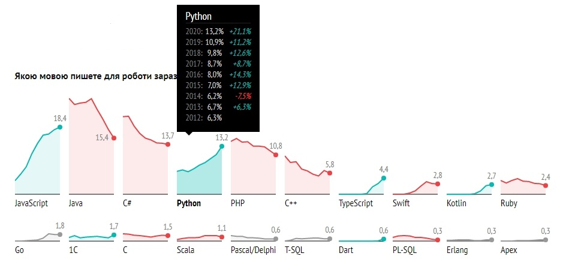
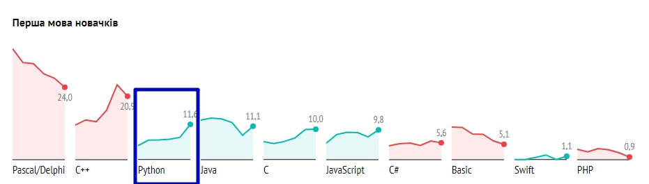
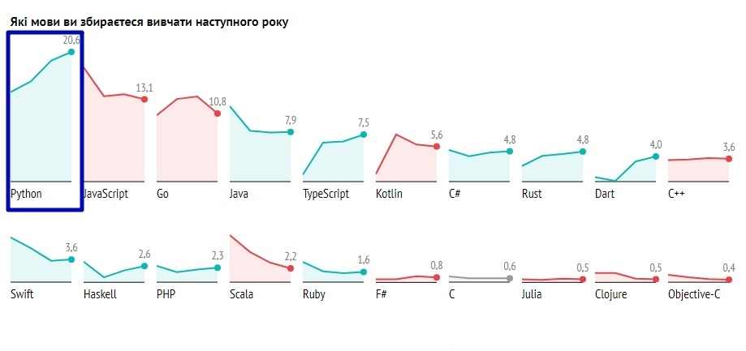

# Python
**Python** - это современный язык программирования, который применяется в сферах создания систем искусственного интеллекта, анализа данных и написания скриптов для Web-серверов  

Согласно данным авторитетного ИТ-портала <a href = "https://dou.ua/">DOU.ua</a> входит в ТОП-5 по доле использования в Украине.

**Python** - растет непрерывно за последние 6 лет и имеет самые высокие темпы роста среди ТОП-5 языков.

С каждым годом растет количество людей, для которых Python является первым языком программирования

Роста и популярность **Python** будет продолжаться и в будущем, т.к. постоянно растет доля тех, кто выбрал бы **Python** для реализации своих проектов

Также - это тот язык, который планируют выучить в ближайшее время самое большое количество ИТ-специалистов.

