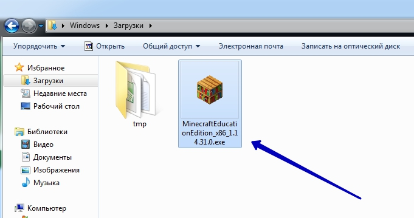
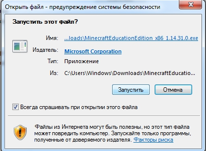
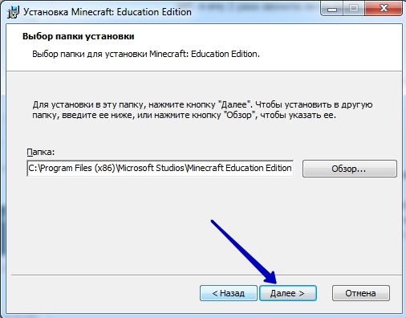
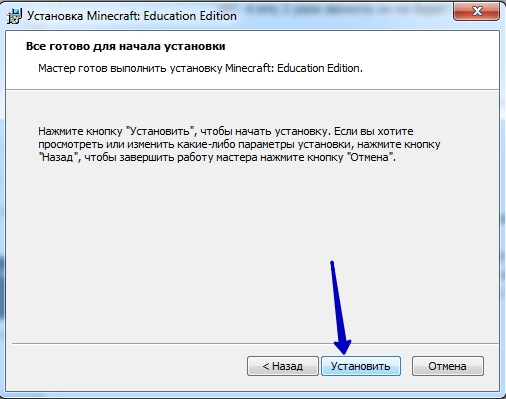
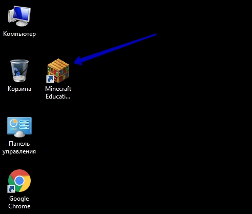

# Установка MinecarftEducation
Для того, чтобы установить программу для работы в среде Minecraft Education, скачайте его с  <a href ="https://education.minecraft.net/get-started/download">официального сайта</a>.
 
**Запустите скачанный файл:**  
 

 
**Приймите условия лицензионного соглашения и нажмите 'далее':**  
  
**В процессе установки нажимайте 'далее' и 'установить':**  

  
**Запустите установленную программу:**  
  
**После появления блока 'Войти'. Нажмите 'Назад'**  
  
**Примите условия и нажмите 'Играть'**  
 
