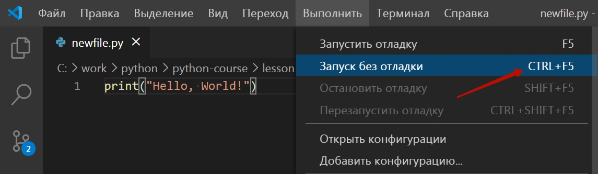

## Установка IDE
Для того, чтобы запустить программу на языке программирования Python на локальном компьютере необходимо:
- Скачать и установить интерпретатор Python https://www.python.org/downloads/
- Установить и настроить IDE
  - Скачать и установить программу <a href = 'https://code.visualstudio.com/'> Microsoft VS Code</a>
  - Установить расширение Python в Microsoft VS Code   
  - 
## Запуск IDE
## Первая программа

```python
print("Hello, World!")
```

**Для её запуска необходимо создать новый файл:**  
  
**Ввести код программы:**  
  
**Сохранить файл:**  
  
**Выбираем расширение и имя файла:**  
  
**Запустите программу (пункт меню "Выполнить/Запустить без отладки"). Или нажмите CTRL+F5 на клавиатуре:**  
  
**Смотрите результат в консоли:**  


Программа print("Hello, World!") выводит результат (текст  "Hello, World!" выводится в консоль)  
